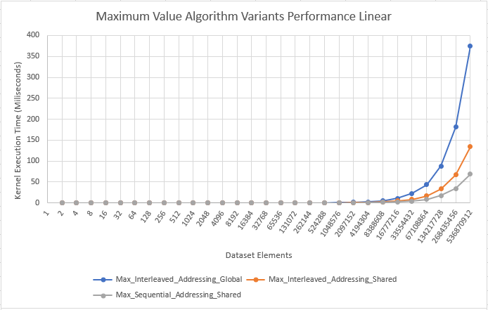
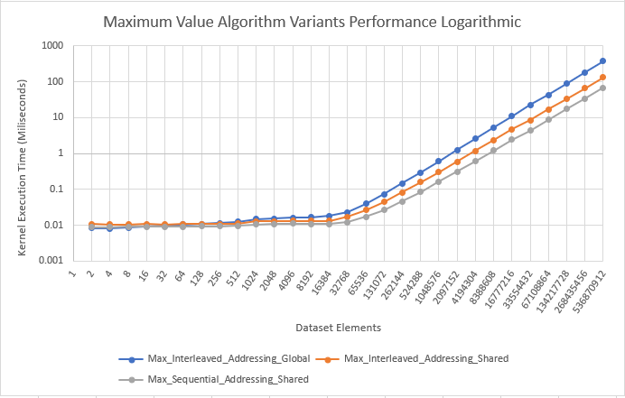
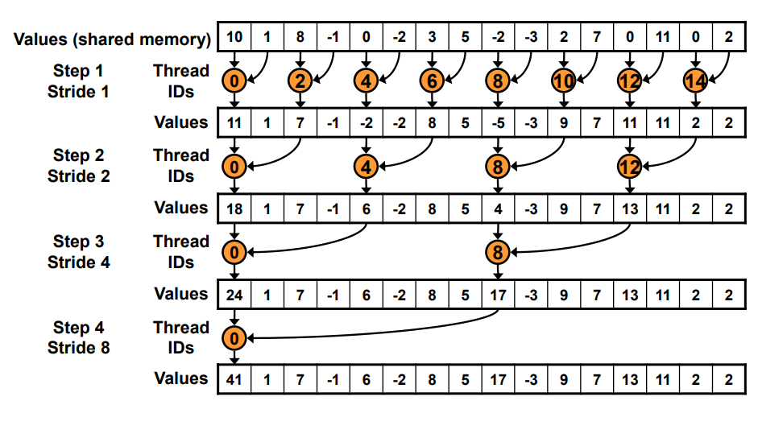
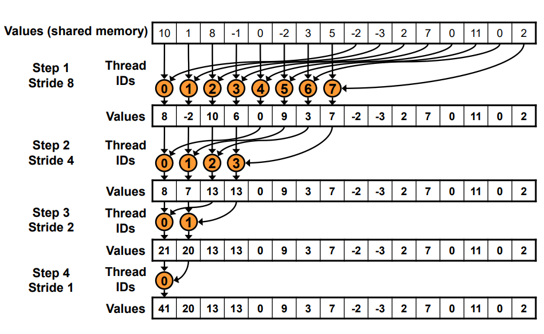

# Maximum Value Algorithm Variants Using Parallel Reduction

The purpose of this program is to benchmark different variants of an algorithm for finding the maximum value in a set of elements. The data sets in this program are all randomly generated using rand. This program outputs the performance of each algorithm to the command line in csv format. 

## What is Parallel Reduction?

Parallel Reduction is a common way of making associative operations (operations that can be performed in any order, such as addition, multiplication, etc.) run in Parallel.

## RESULTS
The following graphs were created in Excel from data generated through the benchmark mode of the application

Three algorithms were tested in this benchmark.

 - Interleaved Addressing and Global Memory
 - Interleaved Addressing and Shared Memory
 - Sequential Addressing and Shared Memory

The sequential addressing with shared memory was the fasted variant. Sequential addressing is faster than Interleaved addressing because all the memory that needs to be referenced is grouped together in consecutive memory addresses. The following are visuals found in [*Nvidia's Optimizing Parallel Reduction in CUDA*](https://developer.download.nvidia.com/assets/cuda/files/reduction.pdf). 

## Interleaved Addressing

Interleaved addressing divides each section of the data into subsets called strides. Each iteration the size of the stride doubles, until the stride length is equal to the size of the dataset. With Interleaved addressing, the first element of the stride is where the result for that group is stored. This is more inefficient compared to sequential addressing, due to the way the gpu access global memory. When requesting data from a particular element in global memory, the gpu actually returns an entire chunk of data, rather than a single element.

## Sequential Addressing

Since sequential addressing stores each result consecutively, fewer memory requests are needed, since a single request will return a large chunk of addresses. This is why sequential addressing is so much faster. 

## Shared Memory
Shared memory is closer to the streaming processor, and is significantly faster to read and write to than global memory. This is why the shared memory version of the interleaving algorithm is faster than the global memory version of the interleaving algorithm.
